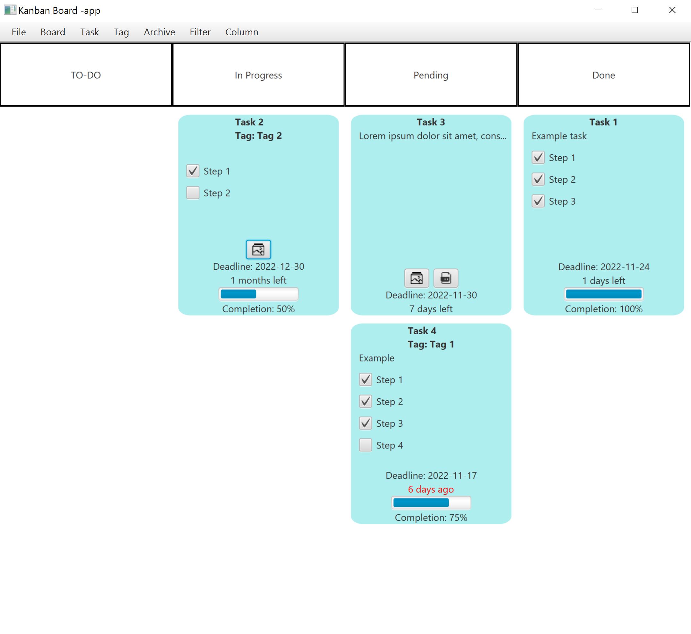
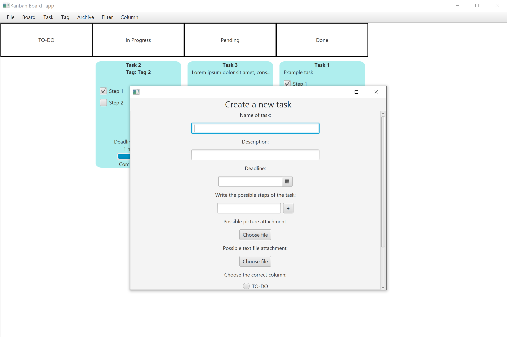
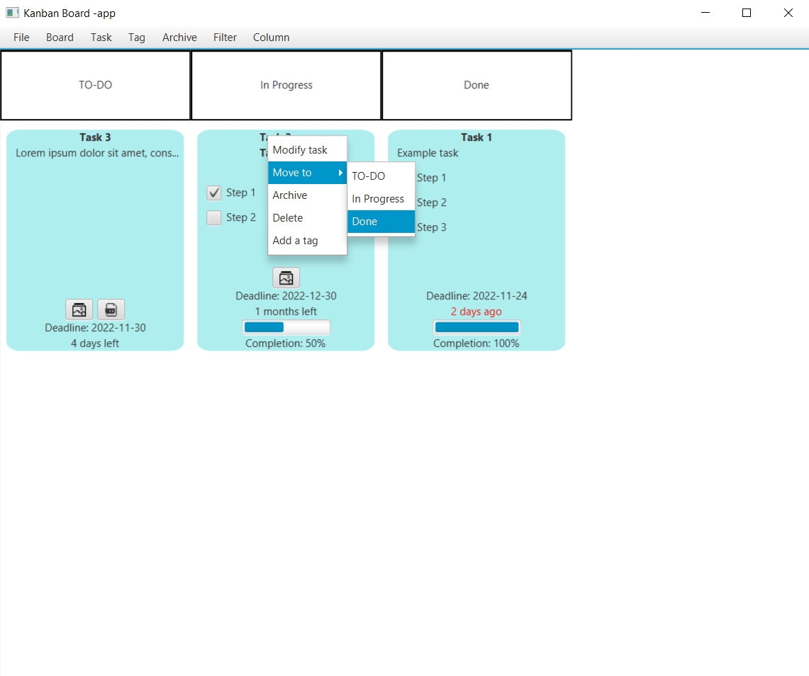
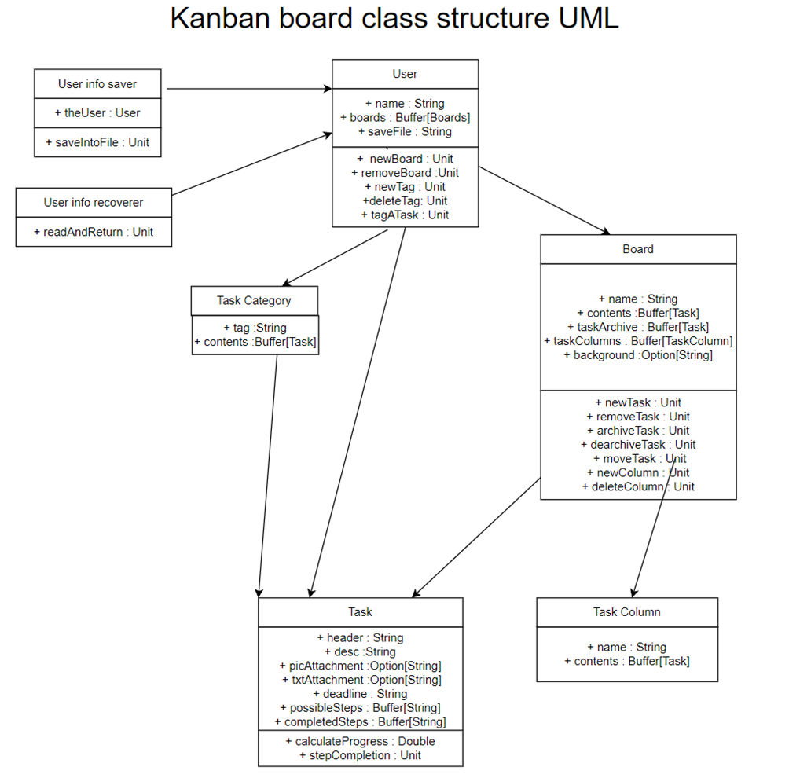

# Kanban board -app

#### Description:

A Kanban board -application, similar to likes of Trello and Microsoft Planner.
Kanban is a methodology for managing different workflows by organizing tasks and applying certain practices and principles.
A Kanban board is a tool for sorting different tasks and keeping track of their progress. To read more about Kanban click [this](https://kanbanize.com/kanban-resources/getting-started/what-is-kanban)

#### Tech:
Language: Scala. Build tool: sbt. 

UI built with ScalaFX. ScalaFX is a DSL wrapper for using JavaFX with Scala.

#### Instructions:

The program is started by launching the “GUI” JavaFX Application from the source code. This launches the graphical user interface.
If one has never used the program before, a welcome window pops up. After a username is given, the new user gets to create their first board.
A board needs a name and columns. A background is obligatory. After creating the first board, the app is ready to go.
On the menu bar one can find options for creating tasks, boards, task categories, task filters, columns etc.
Most of the important methods reside there. To get started, one must create tasks and apply them to the board.
After a board has tasks, they can be moved by right-clicking the label, selecting “move” and choosing the correct column.
That is how one gets started. Functionalities are very straightforward and are found in the menu bar or by right-clicking the content you are seeking to modify/move.
When it’s time to close up, seek the “File” menu and press “Save and exit”. This is a crucial step as otherwise, the most recent user data gets lost.
After a user has saved their data, the next time the application starts, it opens the most recently saved user information and shows the latest used board automatically.

#### Visual examples:

#### UML:

